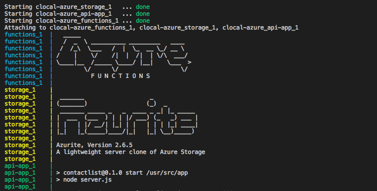
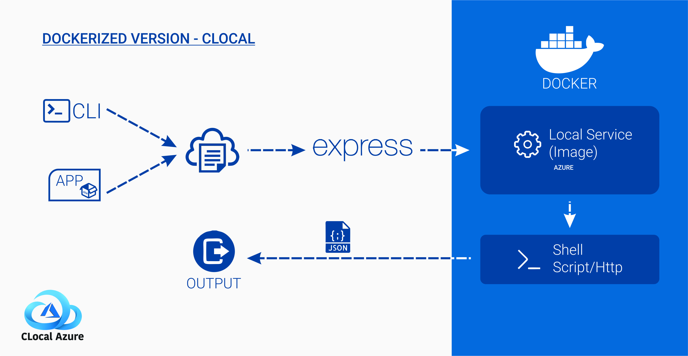

<h1 align="center">
  <a href="https://lakindu95.github.io/clocal-azure"></a>
</h1>

<h4 align="center">
An emulation engine for Azure Services 
</h4>

<p align="center">
 <a href="https://github.com/cloudlibz/clocal-azure"></a>
 <a href="https://gitter.im/cloudlibz/clocal-azure"></a>
 <a href="https://saythanks.io/to/lakindu95"></a>
 <a href="https://opensource.org/licenses/Apache-2.0"></a>
 <a href="http://hits.dwyl.io/cloudlibz/clocal-azure"></a>

</p>

_Clocal-azure_ provides an easy-to-use test/mocking framework for developing Cloud applications.

Currently features are under development.

## 🚀 Install

### Requirements

* NodeJS (^8.9.4)
* yarn (^1.6.0)
* Docker
* MYSQL
* MongoDB 

```
$ git clone https://github.com/cloudlibz/clocal-azure.git
$ cd clocal-azure
$ yarn
$ yarn link (Install clocal commands)
$ yarn start <command>
         or
$ clocal <command>
```

# 📚 Overview

_Clocal-azure_ spins up the following core Cloud APIs on your local machine:

## 📟 Services & Ports
* **[Azure Functions](./docs/azure-functions.md)** at http://localhost:9574
* **[Azure Storage](./docs/azure-storage.md)** at http://localhost:9569 (Blobs), http://localhost:9570 (Queues), http://localhost:9571 (Tables)
* **[Azure CosmosDB](./docs/azure-cosmosdb.md)** (Only windows supported) port will be given by the emulator with the IP address
* **[Azure SQL Service](./docs/azure-sql-server.md)** at http://localhost:3306
* **[Azure Key Vault](./docs/azure-keyvault.md)** at http://localhost:8200
* **[Azure Search](./docs/azure-search.md)** at http://localhost:9520
* **Azure API App Service** at http://localhost:9567
* **[Azure CLI 2.0](./docs/azure-cli.md)** No ports

## Commands

### All Services at once

Step 1: Go to ```compose.env``` file and specify the path to create the images for *azure functions* and *azure api app service* and *azure cosmosdb*.

Step 2: Run the shell script as below.

Ubuntu OS: `$ yarn service` or `$ bash compose.sh` 

Mac OS: `$ yarn service` or `$ bash compose.sh` or `$ sh compose.sh`




### Azure Functions

* **Init Functions**
```
$ clocal function-init <folder>
```
Azure functions working directory is located in example/azure-functions.
You can create a folder inside the location and give the folder location.
Then attach the init file where the service starting file.
Example: ```clocal function-init function-sample```

* **Start Functions**
```
$ clocal function-start
```
* **Stop Functions**
```
$ clocal function-stop 
 ```

### Azure Storage 
Azure storage comprises of azure blobs, queues and tables. See the example/azure-storage for sample project.

* **Start Storage**
```
$ clocal storage-start
```
* **Stop Storage**
```
$ clocal storage-stop
```
* **Clear all files created**
```
$ clocal storage-clear
```
* **List files**
To list all files
```
$ clocal storage-query
```
To list specific folder files
```
$ clocal storage-query folder_name
```

### Azure CosmosDB (Only Windows Supported)

* **Init CosmosDB**
```
$ clocal cosmosdb-init
```
This will create the in-built image of the Cosmos DB emulator and will be on ready state to start the container.

* **Start CosmosDB**
```
$ clocal cosmosdb-start
```
* **Stop CosmosDB**
```
$ clocal cosmosdb-stop
```

### Azure SQL Server

* **Start SQL Service**
```
$ clocal sql-start
```
* **Stop SQL Service**
```
$ exit
```

### Azure KeyVault

* **Start KeyVault**
```
$ clocal keyvault-start
```

* **Stop KeyVault**
```
$ clocal keyvault-stop
```

### Azure Search

* **Start Search**
```
$ clocal search-start
```
* **Stop Search**
```
$ cmd + c / ctrl + c
```

### Azure CLI 2.0

* **Start CLI**
```
$ clocal cli-start
```
* **Exit CLI**
```
$ exit
```

### Azure API App Service 

Azure API working directory is located in example/azure-api-service.
You can create a folder inside the location and give the folder location.
Then attach the init file where the service starting file.

Example: ```clocal api-start ./ api.json```

```
$ clocal api-start <folder> <init-file>
```

## 📝 Example Documents

* **[Azure Functions](./docs/azure-functions.md)**
* **[Azure Storage](./docs/azure-storage.md)**
* **[Azure Cosmos DB](./docs/azure-cosmosdb.md)**
* **[Azure SQL Service](./docs/azure-sql-server.md)**
* **[Azure KeyVault](./docs/azure-keyvault.md)**
* **[Azure Search](./docs/azure-search.md)**
* **[Azure CLI](./docs/azure-cli.md)**


## 📺 Demo Video Series

* **[Video Playlist](https://www.youtube.com/watch?v=rpUJ44D_7Tk&list=PLbd4A5tkijhDGRQp6BcrwGhRvS0TU8zhQ)**


## 🔧 Testing

Before runs the tests, make sure all docker images have been installed.

```
$ yarn test
```

## 📝 Architecture 

<p align="center">
  <a href=""></a>
  Sent by Gaurav Pandey
</p>

## 🙋 Contributing

Please read [CONTRIBUTING.md](./CONTRIBUTING.md) for details on our code of conduct, and the process for submitting pull requests to us.

## 📜 License

This project is licensed under the Apache License 2.0 - see the [LICENSE.md](./LICENSE) file for details

## Acknowledgments

The project clocal-azure is initially developed for the Google Summer of Code 2018. Special thanks goes to my mentors [Rumesh](https://github.com/rehrumesh), [Lasitha](https://github.com/lasitha-petthawadu) and [Rajika](https://github.com/rajikaimal) and [CloudLibz Organization](https://github.com/cloudlibz).

Second phase of clocal-azure carried out for Google Summer of Code 2019. Once again I would like to thank my mentors [Rumesh](https://github.com/rehrumesh), [Sammani](https://mvp.microsoft.com/en-us/mvp/Sammani%20Palansuriya-5000835), [Rajika](https://github.com/rajikaimal) and [Dilantha](https://github.com/dilantha111).

Changes required. 
