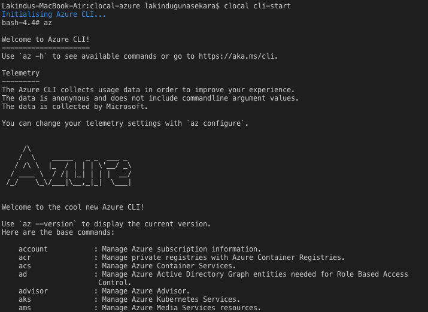

# Azure CLI Example

## Pre Requisites 

* **Node.js 8.5 or greater**
* **Docker running locally**

The Azure CLI 2.0 is the officially supported docker image by microsoft. Therefore the command to start and stop the CLI are as follows.

## Step 1: 

Start the service

```clocal cli-start```

## Step 2:

Stop the service

```exit```

## Expected Results


