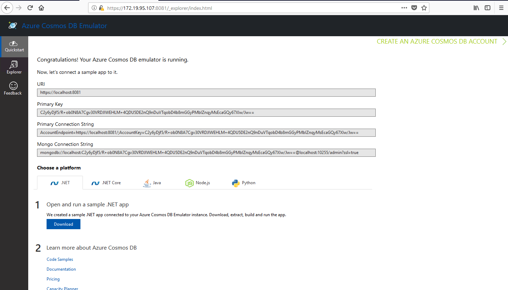
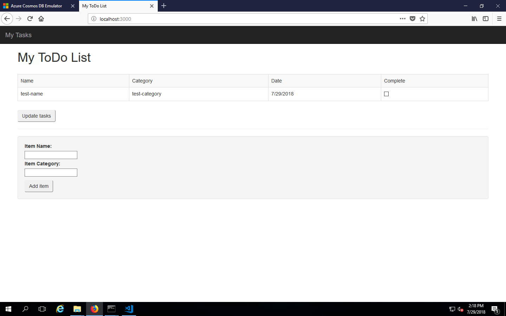
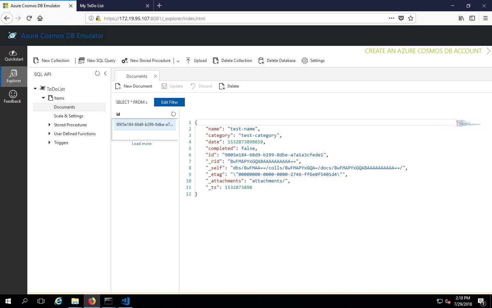

# Azure CosmosDB Example (Only Windows Supported)

## Pre Requisites 

### Software requirements

* **Windows Server 2012 R2, Windows Server 2016, or Windows 10**
* **Node.js 8.5 or greater**
* **Docker running locally**

### Hardware requirements
* **2-GB RAM**
* **10GB available hard disk space**

## Step 1:

Azure Cosmos DB is having limitations according to the [Azure documentation](https://docs.microsoft.com/en-us/azure/cosmos-db/local-emulator#differences-between-the-emulator-and-the-service).

To start off, build the image in our source first.
```
clocal cosmosdb-init
```

This will create the image and will be in a ready state to start a container from the created image.

## Step 2:

After creating the image, start the container.
```
clocal cosmosdb-start
```

## Step 3:

After starting the container, navigate to the Host URL given in the terminal. 
For an example: https://172.19.85.204:8081/_explorer/index.html

You will be able to see the home page of the CosmosDB emulator.




## Step 4: 

Now go the [examples](./../example/azure-cosmosdb/config.js) folder, and then in the config.js, add the URI which is given by the cosmos db emulator. 

## Step 5:

Now run the sample project by installing the node modules and start.
```node install``` 
and 
```npm start```





* **Stop CosmosDB**
```
clocal cosmosdb-stop
```


