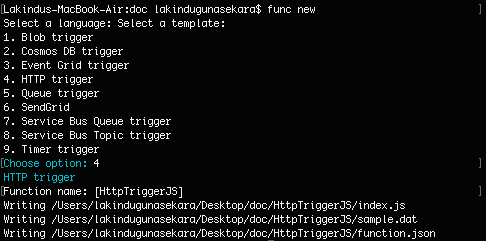
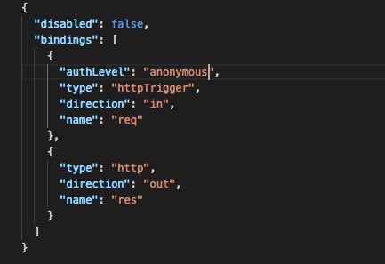
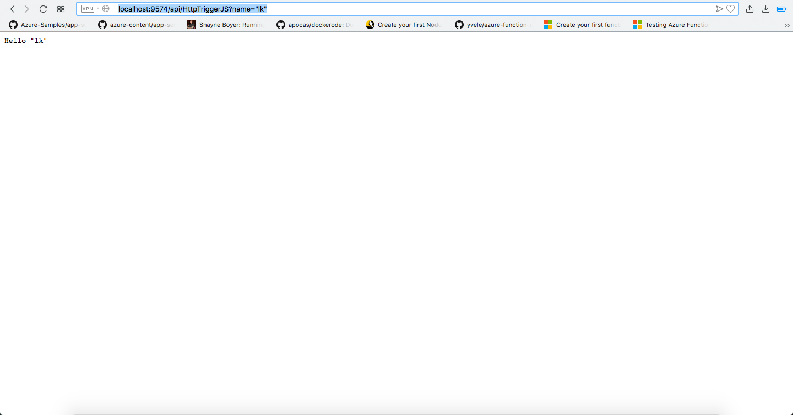

# Azure Functions Example

## Pre Requisites 

* **Node.js 8.5 or greater**
* **Docker running locally**
* **Azure CLI (or Cloud Shell)**
* **[Azure Functions Core Tools v2](https://docs.microsoft.com/en-us/azure/azure-functions/functions-run-local)**

## Step 1:

Go to ```project directory -> example -> azure-functions```

After installing the pre requisities, you need to create a project in the above mentioned directory from Azure Fucntions Core Tools in order to create a function.

```func init . --docker```


With the above command, you will be creating a functions project. Then at the end we will be providing a "--docker" in order to create a Dockerfile along with the initial stage.

If Dockerfile is not created, create the file as below. 

### DockerFile

```
FROM microsoft/azure-functions-runtime:v2.0.0-beta1
ENV AzureWebJobsScriptRoot=/home/site/wwwroot
COPY . /home/site/wwwroot
```

## Step 2: 

Create a function type accordingly with the following command.

```func new```



## Step 3:

Go to the created function. For me it's HttpTriggerJS folder -> function.json
Change the authLevel to "anonymous".



## Step 4: 

Pull the docker image

```
docker pull microsoft/azure-functions-node8
```

## Step 5: 

Go to project terminal and init the file

* **Init Functions**
```
clocal function-init <folder>
```
Azure functions working directory is located in example/azure-functions.
You can create a folder inside the location and give the folder location.
Then attach the init file where the service starting file.
Example: ```clocal function-init function-sample```

* **Start Functions**
```
clocal function-start
```
* **Stop Functions**
```
 clocal function-stop 
 ```

## Expected Result





