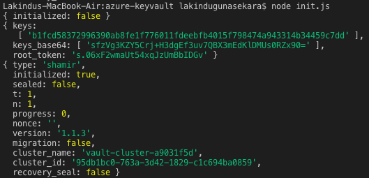
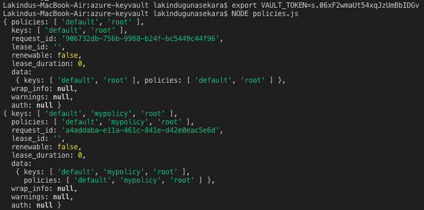

# Azure Keyvault Example

## Pre Requisites 

* **Node.js 8.5 or greater**
* **Docker running locally**

To provide the azure keyvault experience we have integrated Hashicorp vault. This documentation provides a step by step guidance on how you can use the service.

## Step 1: 

Start the service

```clocal keyvault-start```

## Step 2: 

Now since the vault has started, you can go to provided examples and use your vault. As for the examples, we used "[Node Vault Client](https://github.com/kr1sp1n/node-vault)" repository examples as the project more works with NodeJS. We would like to thank Node Vault creators for their contribution. 

Go to ```project directory -> example -> azure-keyvault```

## Step 3: 

Install dependencies in the folder.

```npm install```

## Step 4: 
Initialise your vault by running the init.js file.

```node init.js```

## Step 5:

You should see `root_token: ` followed by a long key in the response.
Please copy that long key and export it as environment variable:

```export VAULT_TOKEN=<insert long key here>```

Now you are able to run all of the other [examples]:
```node policies.js```

For more examples - Node Vault: https://github.com/kr1sp1n/node-vault/tree/master/example

## Step 6:

Stop the service

```clocal keyvault-stop```

## Expected Results




