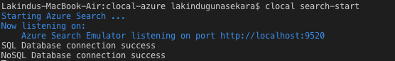
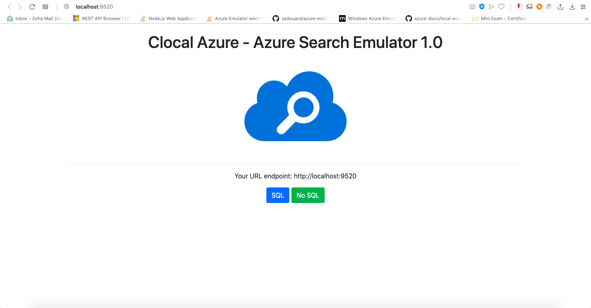
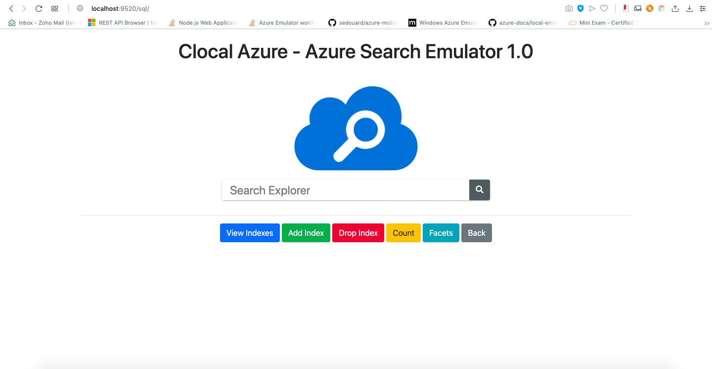
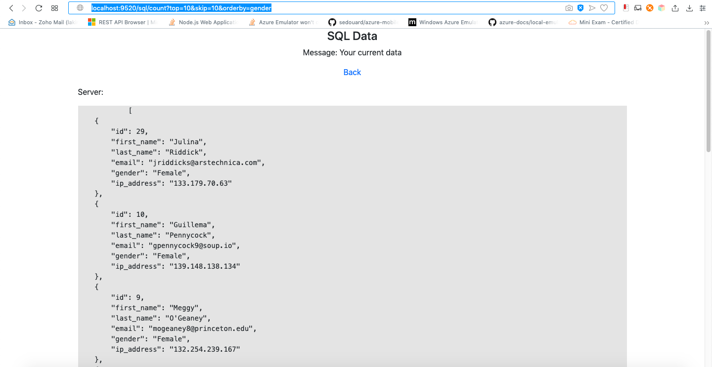
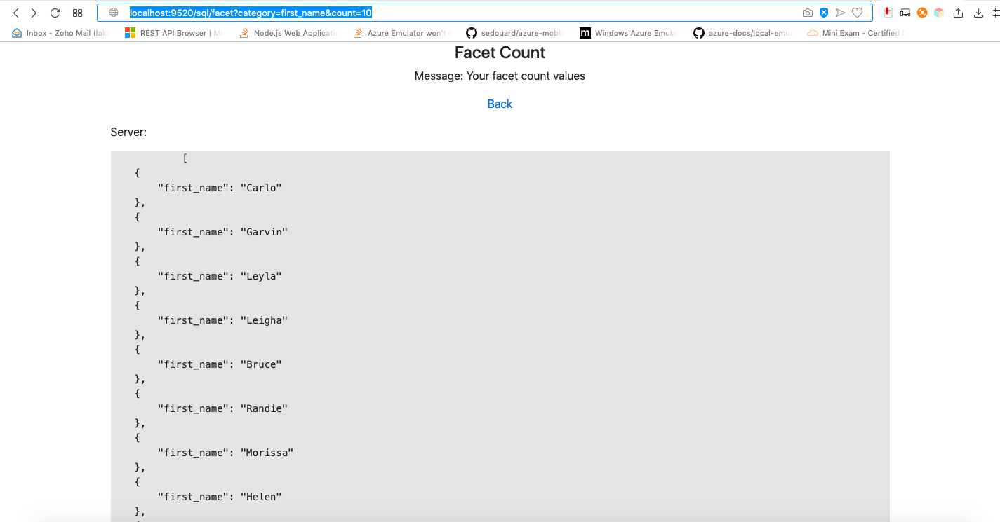

# Azure Search Example

## Pre Requisites 

* **Node.js 8.5 or greater**
* **Docker running locally**
* **MySQL Server**
* **MongoDB Service** 

Azure Search Emulator provides the support on following services on SQL and NoSQL sources,

* Search queries
* View Indexes
* Create Indexes
* Drop Indexes
* Count (top, skip & orderby)
* Facets (count & category)

Depending on your data source, Azure search currently supports MySQL and NoSQL sources. As for the first step, the data needed to be loaded to the sources. If you want to test the searcg service we have provided a sample mock data as follows.

* For SQL - [Mock Data](../example/azure-search/MOCK_DATA_SQL.txt)
* For NOSQL - [Mock Data](../example/azure-search/MOCK_DATA.csv)

The guide will be divided into two sections depending on the data source. 

## MYSQL

### Step 1:

Before starting the service, it is recommended to start MySQL server which is having in your machine or run our [MYSQL server docker image](./azure-sql-service.md). 

If you are using the provided Azure MySQL service, there are few configurations needs to be given in order to get a successful connection. 

```ALTER USER 'root'@'localhost' IDENTIFIED WITH mysql_native_password BY '';```

```CREATE USER 'root'@'%' IDENTIFIED BY '';```

```GRANT ALL ON *.* TO 'root'@'%';```

```ALTER USER 'root'@'%' IDENTIFIED WITH mysql_native_password BY '';```

```FLUSH PRIVILEGES;```

The password and the username is up to the user to define. Currently in the above example no password is provided. 

### Step 2: 

After the changes done with the provided SQL server, proceed with providing data. 

* For SQL - [Mock Data](../example/azure-search/MOCK_DATA_SQL.txt)

Copy the SQL data or import the data to the MySQL server.

### Step 3: 

After data loaded to MySQL, run the Azure Search Emulator. 

```clocal search-start```

## NOSQL

### Step 1: 
Install MongoDB to your machine. 

### Step 2:
Import the mock csv data to mognodb or upload your own dataset.

```mongoimport -d mysampledb -c users --type csv ./example/azure-search/MOCK_DATA.csv --headerline```

### Step 3: 
Run mongodb service

```Mongod```

and 

```mongo```


## Expected Results







## Create and Drop Indexes 

In order to create and drop indexes, there is a [config.js](./../src/services/azure-search/config.js) file which holds all the setting details. Following are the index details filled for the mock data set provided. You have to change the values in the config file for any other dataset. 

```config.indexName = 'idx_users';```

```config.indexSQLColumns = 'first_name, last_name';```

```config.indexNoSQLColumns = {first_name: 1, last_name: 1};```

After setting up the values, you can start the service and a simple button click / call a GET API will create/drop the index.

http://localhost:9520/sql/indexes/create

http://localhost:9520/sql/indexes/drop

http://localhost:9520/nosql/indexes/create

http://localhost:9520/nosql/indexes/drop

Note: 

* Filters are the data needed to be displayed with the searched data
* Searchables are the column values looking to search.


## Provided API's

The following sample APIs are based on the mock data, you can repalce your own dataset values.

### Count

In order to work around the pagination through REST API, we have added following parameters.

1. Top
2. Skip
3. Order by

For more information visit [official documentation](https://docs.microsoft.com/en-us/azure/search/search-pagination-page-layout).

* Sample API's

    http://localhost:9520/sql/count?top=10

    http://localhost:9520/sql/count?orderby=gender

    http://localhost:9520/sql/count?top=10&skip=10

    http://localhost:9520/sql/count?top=10&orderby=gender

    http://localhost:9520/sql/count?top=10&skip=10&orderby=gender

* Result

    


### Facets

Facets are currently supporting up to the count parameter with the category. For more information visit the [official document](https://docs.microsoft.com/en-us/rest/api/searchservice/Search-Documents).

* Sample API

    http://localhost:9520/sql/facet?category=first_name&count=10

* Result

    