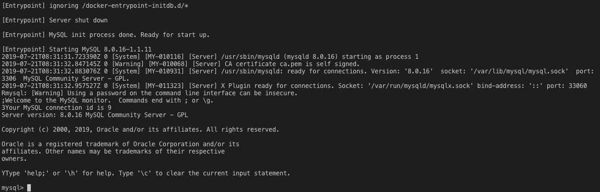
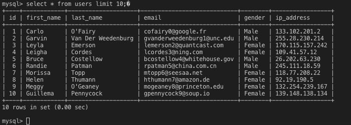

# Azure SQL Server Example

## Pre Requisites 

* **Node.js 8.5 or greater**
* **Docker running locally**

The SQL server in azure is similar to MySQL server, therefore to emulate the service, docker image of MySQL server is used.

## Step 1:

Start the service

```clocal sql-start```

## Step 2: 

After running the service there are few configurations to be done in order to connect with a local project. 

```ALTER USER 'root'@'localhost' IDENTIFIED WITH mysql_native_password BY '';```

```CREATE USER 'root'@'%' IDENTIFIED BY '';```

```GRANT ALL ON *.* TO 'root'@'%';```

```ALTER USER 'root'@'%' IDENTIFIED WITH mysql_native_password BY '';```

```FLUSH PRIVILEGES;```

The password and the username is up to the user to define. Currently in the above example no password is provided. 

## Step 3: 

After the changes done with the provided SQL server, proceed with providing data. 

* [Mock Data](../example/azure-search/MOCK_DATA_SQL.txt)

Copy the SQL data or import the data to the MySQL server.

## Step 4:

Now run a query and check if the data shows,

```Select * from users limit 10```

## Expected Results






