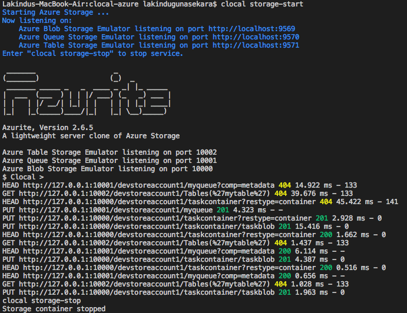
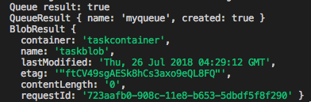
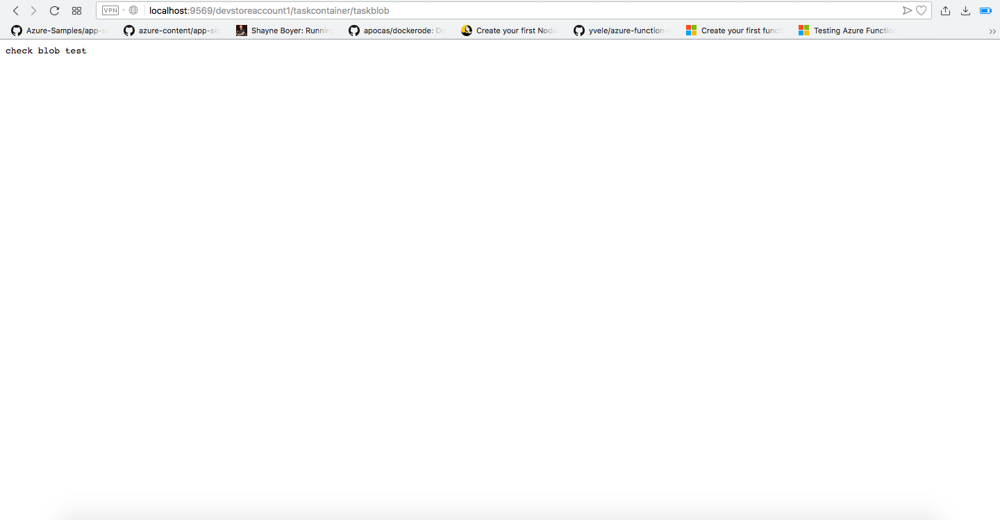

# Azure Storage Example

## Pre Requisites 

* **Node.js 8.5 or greater**
* **Docker running locally**
* **Azure CLI (or Cloud Shell)**
* **[Azure Storage Module](https://www.npmjs.com/package/azure-storage)**

## Step 1:

Azure storage comprises of three main services. Blob storage, queue storage and table storage.

Make a node project first, which is given in the example/azure-storage folder.

```
npm init --yes
```

## Step 2:

Add the developer credentials to the Azure CLI cross platform

```
$ az storage container create --name 'test' --connection-string 'DefaultEndpointsProtocol=http;AccountName=devstoreaccount1;AccountKey=Eby8vdM02xNOcqFlqUwJPLlmEtlCDXJ1OUzFT50uSRZ6IFsuFq2UVErCz4I6tq/K1SZFPTOtr/KBHBeksoGMGw=='

{
  "created": true
} 
```

## Step 3:

Pull the docker image

```
docker pull arafato/azurite
```

## Step 4: 

Refer the documentation for the functionalities provided by the [azure storage library](https://www.npmjs.com/package/azure-storage).

And refer the project in the [examples](./../example/azure-storage/storage-example.js) of the project.

## Step 5:

Now run the server and following are the commands.

* **Start Storage**
```
clocal storage-start
```
* **Stop Storage**
```
clocal storage-stop
```
* **Query Created Files**
```
clocal storage-query <query>
```
Where query is `ls` or `ls <filename>` . when query is `ls` it lists all the files and if `filename` is specified , it lists only specific files.

* **Clear all files created**
```
clocal storage-clear
```

## Step 6:

Go to the project you have created using azure storage. And start the project.

## Expected Results








